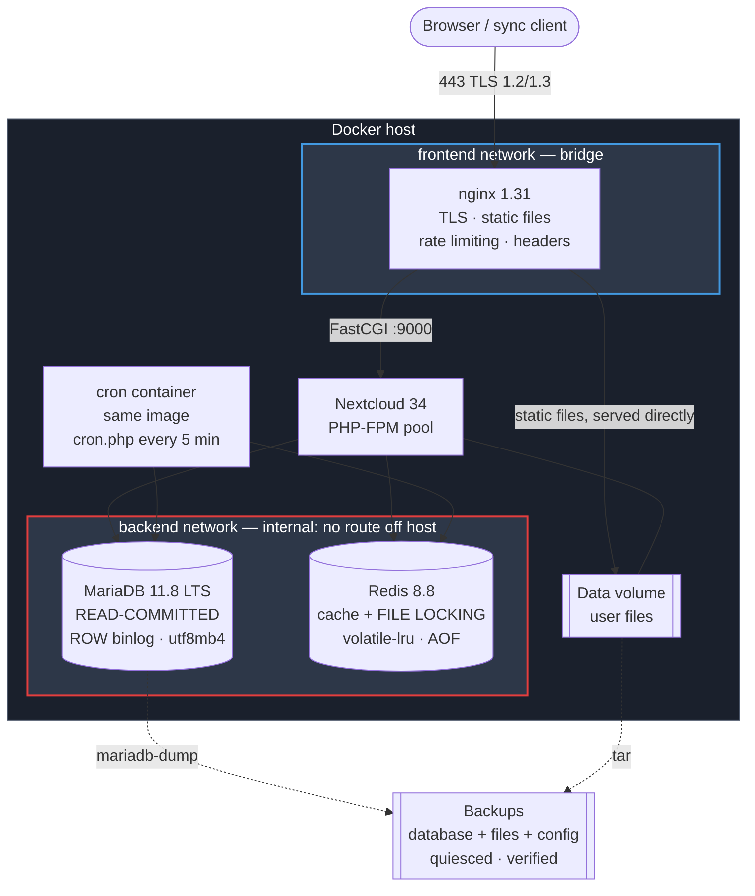

# Nextcloud private cloud

[](https://github.com/rthway/nextcloud-private-cloud/actions/workflows/ci.yml)
[](https://github.com/rthway/nextcloud-private-cloud/actions/workflows/release.yml)
[](LICENSE)
[](https://github.com/nextcloud/server)
[](https://mariadb.org/)

Deployment, operations and observability engineering around Nextcloud.
**This repository contains no Nextcloud source code.** Nextcloud Server is
developed by Nextcloud GmbH under the AGPL-3.0; what is here is the
infrastructure that runs it, and the reasoning behind each decision.

---

## The problem this solves

A single-container Nextcloud works until it has users. The gap between that
and something you would trust with a team's files is where this lives:

- **File locking.** Nextcloud needs Redis for transactional locking. Without
  it, it falls back to the database and concurrent access produces *"file is
  currently locked"* errors that users report as data corruption.
- **Background jobs that silently stop.** The default is AJAX cron, which runs
  scheduled work only when someone loads a page. Trash never expires, shares
  never lapse, file scans never run — and the container stays green throughout.
- **Backups that are three artefacts, not one.** Database, file content, and
  `config.php` — which holds `passwordsalt`. Restore a database without the
  matching salt and every user password becomes unverifiable.
- **MariaDB defaults that deadlock.** Nextcloud requires `READ-COMMITTED`
  isolation and `utf8mb4`. The stock isolation level produces intermittent
  deadlocks that read like load.
- **A vhost that leaks.** `config/` and `data/` served as static files is a
  known way to lose a Nextcloud instance entirely.

Each is addressed here, with the reasoning next to the configuration rather
than in someone's head.

---

## Architecture



**nginx serves Nextcloud's static assets directly** from the shared volume and
speaks FastCGI to PHP-FPM for everything else. The web UI is thousands of
small files; routing those through PHP would occupy a worker per icon.

**MariaDB and Redis sit on an internal network with no route off the host.**
The application tier is on both networks because Nextcloud genuinely needs
egress — app store, federation, SMTP, object storage — but the datastores do
not, and that is where segmentation earns its keep. A smoke test verifies the
database container cannot reach the internet.

**The cron container runs the same image**, defined from a shared YAML anchor
so the two cannot drift. A cron container on a different Nextcloud version
than the web container corrupts data during an upgrade.

---

## Verification status

Every claim below was produced by running it, on this hardware, on
2 September 2026. Nothing here is projected.

**Environment:** Windows 11, Docker Desktop 29.7.2 (WSL2), Compose v5.5.0.

| Area | Status | Evidence |
|---|---|---|
| Stack runs | **Verified** | 5/5 containers healthy; TLS 1.3 + HTTP/2 validated against the local CA |
| Security headers | **Verified** | all seven present, each exactly once |
| Sensitive paths blocked | **Verified** | `config/`, `data/`, `lib/`, `3rdparty/`, `db_structure.xml` → 404 |
| CalDAV/CardDAV discovery | **Verified** | both → 301 to `/remote.php/dav/` |
| WebDAV reachable | **Verified** | `/remote.php/dav/` → 401 (the sync-client path) |
| Redis file locking | **Verified** | `memcache.locking` = Redis, `volatile-lru`, 30 live keys |
| Background jobs | **Verified** | mode `cron`, `lastcron` advancing |
| MariaDB invariants | **Verified** | READ-COMMITTED, ROW binlog, utf8mb4 |
| Network isolation | **Verified** | no host ports on db/redis/app/cron; db cannot reach the internet |
| Backup (quiesced) | **Verified** | maintenance mode on, 5/5 core tables, 3 artefacts, checksummed |
| **Backup restores** | **Verified** | 131 tables, 247 indexes, **65 filecache rows vs 65 archived files** |
| **Destructive restore drill** | **Verified** | sentinel gone from disk *and* `oc_filecache`; backed-up file recovered |
| Database restore time | **Measured: 6s** | 131-table schema. Scales with data; not a production figure |
| Image vulnerabilities | **Verified** | 0 fixable HIGH/CRITICAL — **after fixing two real CVEs**, see below |
| Test suites | **Verified** | lint 27 · config 46 · security 14 · smoke 55 = **142 checks** |
| Terraform | **fmt + validate only** | never applied; no AWS account exists behind this repo |
| Production overlay | **Renders only** | never deployed |
| High availability | **Not implemented** | single node |
| Load testing | **Not done** | no throughput or latency figure is claimed anywhere |

### The restore drill

```
probe.txt written, then backed up
sentinel.txt written AFTER the backup, scanned into oc_filecache   (1 row)
  → ./scripts/restore.sh <id> --yes
sentinel.txt on disk              GONE      ← data genuinely came from the backup
sentinel rows in oc_filecache     0
probe.txt on disk                 PRESENT   ← backed-up state recovered
5/5 containers healthy, status.php installed:true
```

The sentinel matters: without it, a restore that silently did nothing would
look identical to a successful one.

### A real vulnerability, found and fixed

Trivy reported two fixable HIGH CVEs in `libexpat` (CVE-2026-66046 and
CVE-2026-76641) inherited from the upstream base image, which had not yet
picked up `2.8.4-r0`. **These were fixed, not suppressed** — the Dockerfile now
applies security updates to inherited OS packages. Exactly one finding is
suppressed, in `.trivyignore` with its full reasoning: the "last USER should
not be root" rule, which PHP-FPM's architecture makes impossible to satisfy.

---

## Quick start

```bash
git clone https://github.com/rthway/nextcloud-private-cloud.git
cd nextcloud-private-cloud

make setup     # .env, generated secrets, local CA + certificate
make up        # build and start; Nextcloud installs itself on first boot
```

Then open `https://nextcloud.localhost:8444`. There is **no `make init`** —
unlike the Odoo project in this portfolio, the upstream image runs the
installer itself from `NEXTCLOUD_ADMIN_USER` and `NEXTCLOUD_ADMIN_PASSWORD`.

```bash
make health           # containers, Nextcloud, locking, database, HTTP, TLS, disk, backups
make test             # 142 checks, about 90 seconds
make backup
make verify-backup    # restores into a throwaway schema and interrogates it
make up-obs           # Grafana :3002, Prometheus :9092
```

---

## Technology stack

| Layer | Choice | Why |
|---|---|---|
| Application | Nextcloud 34.0.3 (fpm-alpine) | newest stable; upgrades are supported and apps are compatibility-checked. [ADR-002](docs/adr/002-version-and-release-channel.md) |
| Database | MariaDB 11.8 LTS | upstream's recommendation; PostgreSQL considered. [ADR-003](docs/adr/003-database-selection.md) |
| Cache + locking | Redis 8.8 | **not optional** — file locking. [ADR-004](docs/adr/004-redis-and-caching.md) |
| Web | nginx + PHP-FPM | static files never enter PHP. [ADR-001](docs/adr/001-container-strategy.md) |
| Object storage | S3 via Terraform | optional primary storage. [ADR-005](docs/adr/005-object-storage.md) |
| Metrics | Prometheus + serverinfo exporter | Nextcloud **does** expose app metrics. [ADR-006](docs/adr/006-observability.md) |
| Logs | Loki + Promtail | Nextcloud JSON parsed at ingest |
| IaC | Terraform | storage, not host config — the reverse of the Odoo project |

Exact versions and licences, including a note on Redis's RSALv2/SSPLv1
licensing and the Valkey alternative: [NOTICE.md](NOTICE.md).

---

## Engineering decisions

**Backups quiesce; the Odoo project's cannot.** Nextcloud can be put into
maintenance mode, so `mariadb-dump` and the file archive describe the same
instant. That matters because the database holds a row per file with its size
and checksum — a skewed backup restores an instance whose metadata does not
match the bytes, and the repair is a full `files:scan` taking hours.
([BACKUP-RESTORE.md](BACKUP-RESTORE.md))

**Restore puts files back before the database.** The intuitive order is
wrong: restoring the database first leaves a window where Nextcloud runs
against metadata for files not yet on disk, and anything touching it then —
the cron container, a sync client — marks them deleted.

**`volatile-lru`, never `allkeys-lru`.** File locks carry no TTL.
`allkeys-lru` permits evicting them, which lets two processes write the same
file. That is silent corruption, not a cache miss, and it is why
`RedisEvictingKeys` is treated as a correctness alert.

**A sidecar publishes the cron timestamp.** The most valuable alert here is
"background jobs stopped", and no exporter provides that metric. Rather than
ship an alert referencing something nothing produces, a small sidecar reads
Nextcloud's own `lastcron` into node_exporter's textfile collector.

**Two IAM identities for object storage.** The application can write user
files; the backup process cannot delete backups. One shared credential would
mean a compromised web application could destroy the backups protecting it.
([ADR-005](docs/adr/005-object-storage.md))

---

## What was removed after checking

Two things an earlier draft did, deleted once the upstream image was actually
inspected rather than assumed:

- **A `pecl install` layer for APCu and imagick.** Both are already present,
  along with redis, memcached, gd, intl, ldap and the rest. The layer added a
  compiler toolchain, build time and version-skew risk for nothing.
- **Duplicate cache, proxy and S3 configuration.** The image already generates
  all of it from the environment. Worse, Nextcloud merges config fragments
  with `array_merge`, so redefining the nested `redis` array to add a timeout
  would have **deleted** upstream's host and password.

`docker run --rm --entrypoint php nextcloud:34.0.3-fpm-alpine -m` is worth
running before adding anything.

---

## Documentation

| | |
|---|---|
| [ARCHITECTURE.md](ARCHITECTURE.md) | components, request path, state, failure behaviour |
| [DEPLOYMENT.md](DEPLOYMENT.md) | local, single-host, and the object-storage path |
| [OPERATIONS.md](OPERATIONS.md) | upgrades, `occ`, credential rotation, maintenance |
| [SECURITY.md](SECURITY.md) | controls, trust boundaries, accepted risks |
| [BACKUP-RESTORE.md](BACKUP-RESTORE.md) | three artefacts, quiescing, RPO |
| [DISASTER-RECOVERY.md](DISASTER-RECOVERY.md) | total-loss recovery, RTO, drill procedure |
| [MONITORING.md](MONITORING.md) | what is measured, what is not, and why |
| [SCALING.md](SCALING.md) | bottlenecks in order; why object storage comes first |
| [TROUBLESHOOTING.md](TROUBLESHOOTING.md) | symptom-first index into the runbooks |
| [CONTRIBUTING.md](CONTRIBUTING.md) | how to change this safely |
| [docs/adr/](docs/adr/) | seven architecture decision records |
| [docs/runbooks/](docs/runbooks/) | nine incident runbooks |
| [docs/architecture/capacity-planning.md](docs/architecture/capacity-planning.md) | the memory and connection arithmetic |

---

## Limitations

- **Single node.** No HA; host failure is an outage until recovery completes.
- **RPO is 24 hours** on the default nightly schedule.
- **Backups pause the instance.** Quiescing is the right trade for
  consistency, but it is downtime — typically the dump duration.
  `--no-maintenance` skips it and accepts the skew.
- **The production overlay and Terraform have never been run** against
  anything real. Both are validated in CI, which is not the same thing.
- **No load testing.** No throughput or latency figure is claimed anywhere.
- **cAdvisor runs privileged**, and **Promtail mounts the Docker socket**.
  Both are opt-in and documented in [SECURITY.md](SECURITY.md).
- **Alertmanager is not deployed.** Rules evaluate; nothing routes them yet.
- **Object storage cannot be enabled on an instance with existing data**
  without a real migration. Decide before the first upload.

## Future improvements

1. **Off-host backup replication** to the bucket Terraform already creates.
2. **Alertmanager**, so the 18 rules reach a person.
3. **Object storage migration tooling**, so the decision is reversible.
4. **A staging environment fed by production restores**, exercising the
   restore path continuously.
5. **Read replica** for reporting, the first useful step toward HA.

---

## Licence and upstream

MIT — **the deployment automation only**. Nextcloud Server remains AGPL-3.0
under Nextcloud GmbH. MariaDB, Redis, nginx and every other component keep
their own upstream terms; note in particular that Redis is no longer
BSD-licensed. Full inventory and obligations: [NOTICE.md](NOTICE.md).
