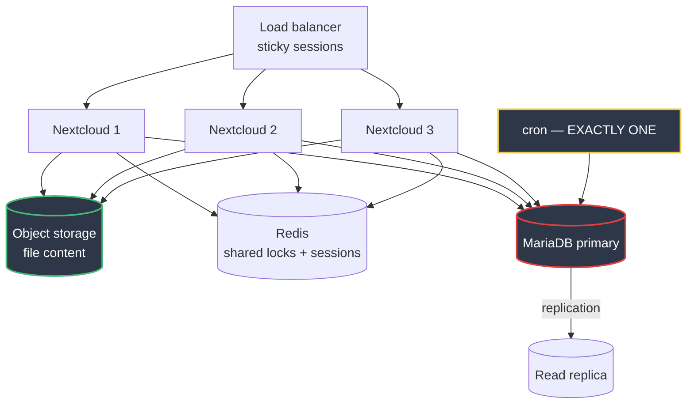

# Scaling

## Where this starts

One host: nginx, PHP-FPM, MariaDB, Redis, cron. On the 4 vCPU / 8 GB
reference host with 32 PHP workers.

**No load testing has been performed.** Nothing below quotes a user count or a
requests-per-second figure, because none has been measured and inventing them
would be worse than the gap. What follows is the order things break in and
what to do about each, which is the part that transfers anyway.

## Bottlenecks, in order

### 1. PHP-FPM workers

Each worker handles one request at a time, so concurrency is bounded by
`PHP_FPM_MAX_CHILDREN`.

**Symptom:** requests queue at nginx and then 504. `active processes` equals
`max children` on the FPM status page.

**Fix:** more vCPU, then more workers — and the container memory limit
alongside. More workers than the CPU can serve makes latency worse.

Check the FPM status page before concluding this, because the next two causes
present identically.

### 2. Database

Nextcloud is read-dominated against `oc_filecache`. If its hot pages do not
fit in `innodb_buffer_pool_size`, every file listing hits disk.

**Before concluding you need a bigger database**, check the two cheap things:
a missing index after an upgrade (`occ db:add-missing-indices`), and whether
the buffer pool is simply too small. Both are minutes of work and both present
as "the database is slow".

Writes are a single writer with no horizontal option. A **read replica** for
reporting is the first genuinely useful step, and also the first step toward
HA.

### 3. Redis

Rarely the bottleneck for throughput, but watch memory. Under `volatile-lru`,
exhausting volatile keys means writes fail with OOM rather than evicting
locks — the correct failure, and still a failure.

### 4. The data directory — the constraint that shapes everything

`/var/www/html/data` is a **shared mutable volume**. Every Nextcloud instance
must see every file, immediately.

**This is why the HTTP tier cannot simply scale out.** A second app container
on another host needs shared storage: NFS/EFS (works, adds latency and a
failure mode) or S3 as primary storage (better, and changes the semantics).

**Moving to object storage is the single highest-leverage change for
scaling**, because it is what makes the HTTP tier genuinely stateless. It is
also why [ADR-005](docs/adr/005-object-storage.md) exists and why the
Terraform is written even though it has not been applied.

### 5. nginx

Last by a wide margin. It serves static files and proxies FastCGI; it will not
be the constraint before everything above.

## Horizontal scaling: what it actually requires

**This is a reference architecture. It is not implemented and not tested.**

Four things must change, and the order matters:

1. **File content to object storage.** Without this, nothing else helps.
2. **Sessions to Redis.** Already the case here — `memcache.distributed` is
   Redis — so sessions are shared, but confirm before removing sticky sessions.
3. **Cron on exactly one node.** Running `cron.php` concurrently on several
   nodes produces duplicate notifications, duplicate share expiries and
   duplicate federated retries. **This is the single most damaging mistake
   available when scaling Nextcloud out**, and nothing warns you.
4. **Redis becomes critical infrastructure.** It was already the lock store;
   with multiple nodes it is the only thing preventing two of them writing the
   same file. A single Redis is now a single point of failure worth clustering.

## What scales, and what does not

| Component | Horizontal? | Notes |
|---|---|---|
| nginx | Yes | stateless |
| PHP-FPM | Yes, **after** content moves to object storage | |
| **cron** | **No** | exactly one node, always |
| Redis | Only with clustering | and locking must remain correct |
| MariaDB writes | **No** | single writer |
| MariaDB reads | Yes | replicas |
| Data directory | Only via shared storage | the constraint |

## Vertical reference

From [docs/architecture/capacity-planning.md](docs/architecture/capacity-planning.md):

| Host | buffer pool | MAX_CHILDREN | db limit | app limit |
|---|---|---|---|---|
| 4 vCPU / 8 GB | 1 GB | 32 | 2 GB | 4 GB |
| 8 vCPU / 16 GB | 4 GB | 64 | 6 GB | 8 GB |
| 16 vCPU / 32 GB | 8 GB | 128 | 12 GB | 16 GB |

## Cost

Rough shape, not a quotation — no provider pricing is quoted because it
changes and a stale number is worse than none.

- **Storage dominates** on this workload, unlike most. Lifecycle rules on the
  backup bucket and a default quota per user are the two levers that matter.
- **Egress** is the second line. Sync clients download; a CDN helps only for
  static assets, which are a small fraction here.
- **Object storage request charges** are worth modelling before switching:
  Nextcloud makes a request per file operation, which is why SSE-S3 is used
  rather than SSE-KMS — KMS charges per request and can exceed the storage bill.
- **Compute** scales with worker count. Right-sizing `PHP_FPM_MAX_CHILDREN` to
  real concurrency is the cheapest optimisation available.
- **Managed database** costs more and buys automated backups, PITR and
  failover. For a service holding an organisation's files, usually a good trade.

## When Kubernetes makes sense

[ADR-001](docs/adr/001-container-strategy.md) rejects it for one host. That
changes when file content is on object storage, there is more than one node,
and zero-downtime deployment is a requirement.

**The ordering matters:** adopting Kubernetes before the storage migration
means orchestrating pods that all need RWX access to the same volume, which is
the worst of both worlds.
